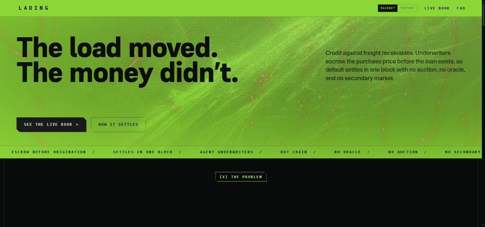
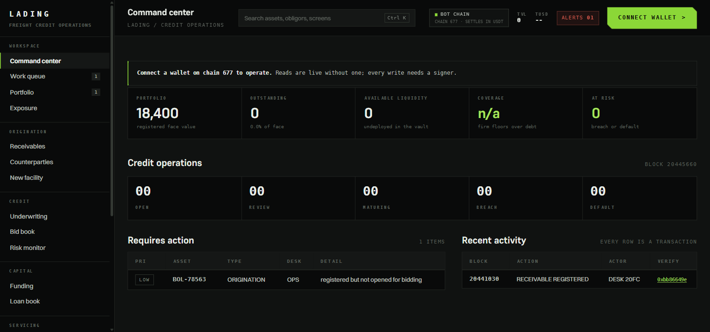

<p align="center">
  
</p>

<h1 align="center">LADING</h1>

<p align="center">
  <strong>The load moved. The money didn't.</strong><br />
  Credit against freight receivables on BOT Chain &mdash; liquidation without a secondary market.
</p>

<p align="center">
  <a href="https://scan.botchain.ai/address/0x83f8C719854a561b38E85484568E59CD34d81525">
    
  </a>
  
  
  
</p>

<p align="center">
  <a href="https://lading-ten.vercel.app"><strong>Live app</strong></a> &nbsp;&middot;&nbsp;
  <a href="docs/ARCHITECTURE.md">Architecture</a> &nbsp;&middot;&nbsp;
  <a href="docs/PRODUCTION.md">Production</a> &nbsp;&middot;&nbsp;
  <a href="ROADMAP.md">Roadmap</a> &nbsp;&middot;&nbsp;
  <a href="SECURITY.md">Security</a>
</p>

---

<p align="center">
  
</p>

<p align="center">
  <em>The credit console, reading BOT Chain mainnet live. Every row links to the transaction that produced it.</em><br />
  
</p>

---

Credit against freight receivables, on BOT Chain. A carrier delivers on Monday, the shipper pays in 90 days, and the carrier needs diesel on Tuesday. LADING closes that gap without a bank, without an oracle, and without a secondary market for the invoice.

---

## The problem

DeFi lending is solvent only because liquidation is instant: default, seize, sell on an orderbook, repay. That requires a liquid market for the collateral.

A freight invoice has no orderbook. One receivable against one shipper cannot be sold in a block. So every RWA lending protocol picks a losing strategy — over-collateralise 2–3× and destroy the point of borrowing, whitelist institutions and reintroduce the trusted third party, or lend on trust (Goldfinch: ~$18M defaults, wound down June 2026).

Nobody built a liquidation engine that works without a secondary market.

## The mechanism

Before any loan exists, an underwriter posts a **firm purchase bid** at price `F` and **escrows `F` in full**. They earn a continuously accruing premium for holding that commitment.

On default, the escrow settles to the lender and the invoice transfers to the underwriter — atomically, in one block. No auction. No oracle. No market.

The slot is **permanently contestable**: anyone may displace the incumbent with a higher floor, or the same floor at a lower premium.

Three things fall out of that:

- **Price discovery without a market.** Competition to *buy* produces a live, capital-backed valuation for an asset that has no comparables.
- **Governance-free risk.** `maxLoan = F × (1 − haircut)`. An uncontested floor decays every block until headroom vanishes and the position becomes callable — no vote, no keeper deciding when.
- **Authenticity via incentive.** The underwriter eats the loss on a fake load, so they do real diligence. Incentive alignment replaces oracle attestation.

If no bid arrives, the invoice is not financeable and the protocol says so. Absence of a bid is information, not a failure state.

## The underwriters are AI agents

LADING ships with autonomous agent underwriters. Each holds its own EOA, reads the load and shipper, prices the risk, and **escrows its own capital** against being wrong.

The split inside the agent is deliberate: **the model exercises judgment** (risk grade plus a written rationale), **deterministic code sets the price** (grade → floor and premium). A model that emits a number directly is unauditable and unreplayable. A model that emits a graded rationale, converted by arithmetic you can read, is neither.

The grade and its rationale are written to `proposals.json` beside the number they produced, and a
person approves before any of it reaches the chain. What the chain holds is the price and the
escrow behind it. Committing the rationale on chain is a change to `bid`, and it is not made yet -
so the product says where the reasoning lives rather than implying the chain holds it.

## Prior art

Paradigm's [Blend](https://www.paradigm.xyz/2023/05/blend) (2023) established oracle-free lending against illiquid NFT collateral via a Dutch refinancing auction. LADING differs in four ways that matter:

- **Blend funds nothing up front.** Whether anyone will take the position is discovered *at* the auction. LADING escrows the purchase price **before origination** — the loss floor is funded before the loan exists.
- Blend's auction fires **on exit** and descends. LADING's slot is always live and ascends.
- Blend is two-party. LADING separates lender from underwriter, so the party pricing the asset is not the party funding the loan.
- Blend needs a floor price. Freight invoices have no floor and no comparable set.

## Layout

```
contracts/   Foundry — AssetRegistry, FirmBidMarket, LoanVault, compliance
frontend/    Next.js 16 + wagmi — carrier flow and live auction
docs/        PRD, shipping architecture, production architecture
```

## Contracts

| Contract | Responsibility |
|---|---|
| `AssetRegistry` | ERC-721 record of a receivable: shipper, face value, due date, document hash. Document hashes are unique, so double-pledging the same paperwork is rejected at registration. |
| `FirmBidMarket` | Slots, escrowed bids, contest, premium accrual, floor decay, atomic settlement. Reads no price feed by construction. |
| `LoanVault` | Shared stablecoin pool. Interest by index, borrow capped at market-derived LTV, dual default triggers (maturity and coverage breach). Settlement surplus returns to the borrower, never to lenders. |
| `AllowlistCompliance` | Pluggable participation gate. Swapping it is how the protocol adapts to a jurisdiction without touching market logic. |
| `CounterpartyRegistry` | Names the shippers and carriers behind a receivable, each entry pending until a registrar verifies it. Standalone by design - nothing in the market, the vault or the asset registry reads it, so naming a counterparty on a running deployment never touches escrowed capital. |

### Tests

```bash
cd contracts && forge test
```

82 passing — 7 market unit, 12 vault integration, 8 stateful invariant, 8 counterparty,
14 asset registry, 16 compliance, 17 fixed-point math. The agent's pricing kernel has its own
suite: `cd agent && bun test`.

The invariant suite holds `escrow ≥ floor` and conservation of liabilities across randomised bid, contest, withdraw, decay, and settlement sequences. The integration suite exists because a mocked vault hid two real bugs: settlement could not deliver collateral the market never escrowed, and underwriters were receiving the borrower's *unspent* premium on default — unearned income at the exact moment the commitment ends, which rewards pushing borrowers into default.

## Deploy

```bash
cd contracts
export BOTCHAIN_TESTNET_RPC_URL=...   # testnet first
export STABLE_TOKEN=0x...
forge script script/Deploy.s.sol:Deploy --rpc-url botchain_testnet --broadcast

# then mainnet
export BOTCHAIN_RPC_URL=...
forge script script/Deploy.s.sol:Deploy --rpc-url botchain --broadcast --verify
```

Then record the printed addresses in `frontend/lib/networks.ts`, which is the single source of
truth for every deployment this frontend can point at. They are compiled in rather than read
from the environment because the network switch is a runtime control: a visitor moves between
mainnet and testnet without a rebuild, so a build-time variable could not answer for both. The
only environment variable the app reads is `NEXT_PUBLIC_CHAIN_ID`, which picks the deployment a
fresh visitor lands on.

The UI renders fully either way — deployment turns the controls live, it never decides whether
content is visible.

### Deployed addresses

**BOT Chain mainnet (chain 677)** — live, explorer [scan.botchain.ai](https://scan.botchain.ai)

| Contract | Address |
|---|---|
| `AssetRegistry` | [`0xe33eE752dbb1724f6939A105cecFF2714F684172`](https://scan.botchain.ai/address/0xe33eE752dbb1724f6939A105cecFF2714F684172) |
| `FirmBidMarket` | [`0x83f8C719854a561b38E85484568E59CD34d81525`](https://scan.botchain.ai/address/0x83f8C719854a561b38E85484568E59CD34d81525) |
| `LoanVault` | [`0xCc18DFC9a339d9D1298dbD90617121Ce319D358E`](https://scan.botchain.ai/address/0xCc18DFC9a339d9D1298dbD90617121Ce319D358E) |
| `AllowlistCompliance` | [`0xacadeD6bA05362004A28D64938c6D794536dC3E7`](https://scan.botchain.ai/address/0xacadeD6bA05362004A28D64938c6D794536dC3E7) |
| `CounterpartyRegistry` | [`0xE07f9907fbA27659e1ED8993A2eA8FE343a91f2F`](https://scan.botchain.ai/address/0xE07f9907fbA27659e1ED8993A2eA8FE343a91f2F) |

**Settlement asset:** bridged USDT, [`0xaBabc7Ddc03e501d190C676BF3d92ef0e6e87a3C`](https://scan.botchain.ai/address/0xaBabc7Ddc03e501d190C676BF3d92ef0e6e87a3C) — **six decimals, not eighteen.**

LADING settles in an asset it does not issue. There is no faucet on mainnet and nothing here is
mintable, which is the honest version of an RWA protocol and also the inconvenient one: capital has
to be bridged or bought before the loop can be exercised.

**BOT Chain testnet (chain 968)** — earlier build, explorer [scan.bohr.life](https://scan.bohr.life)

| Contract | Address |
|---|---|
| `AssetRegistry` | [`0xC8D510C1363C3db4965f53bcE16344dBebDAceBA`](https://scan.bohr.life/address/0xC8D510C1363C3db4965f53bcE16344dBebDAceBA) |
| `FirmBidMarket` | [`0x568633C93b80C08BaB755ecab1C8A3216580Fb6A`](https://scan.bohr.life/address/0x568633C93b80C08BaB755ecab1C8A3216580Fb6A) |
| `LoanVault` | [`0x313b5f7E0ce7293fdf9f5d4a5DBF59b07432E37E`](https://scan.bohr.life/address/0x313b5f7E0ce7293fdf9f5d4a5DBF59b07432E37E) |
| `AllowlistCompliance` | [`0x4cb6Cd2bAe5fFDfd06CCD6d4d29219e7AE927f4F`](https://scan.bohr.life/address/0x4cb6Cd2bAe5fFDfd06CCD6d4d29219e7AE927f4F) |
| `TestStable` (tUSD) | [`0x8E601297758B1Fb93C2c30E33F11eA36cd553b2E`](https://scan.bohr.life/address/0x8E601297758B1Fb93C2c30E33F11eA36cd553b2E) |
| `CounterpartyRegistry` | [`0x13d0B6594BBE65C7d496c4Fd1A862b1d112D2dC2`](https://scan.bohr.life/address/0x13d0B6594BBE65C7d496c4Fd1A862b1d112D2dC2) |

Redeployed from the current contracts, so unlike the deployment it replaces it carries floor
decay (`decayRatePerBlock` 2.15e-8 RAY, the same as mainnet). It settles in a token this project
mints, which is what makes it safe to run the agents unattended and what keeps it a demonstration
rather than a market.

## Agents

```bash
cd agent
cp .env.example .env      # addresses are prefilled for mainnet; add keys
bun install
bun test                  # pricing kernel and contest rule
bun run fund              # report agent gas and capital, move nothing
bun run fund:send         # top each agent up from FUNDER_KEY
bun run start             # watch and act        (testnet only)
bun run propose           # grade the book, write proposals.json, touch nothing
bun run execute -- --yes  # escrow capital behind the approved proposals
```

Three underwriters with genuinely different books. Each holds its own EOA and escrows its own
capital, so a generous grade is paid for by whoever produced it.

**Autonomy is drawn from the chain, not from a setting.** On testnet the agents watch the book and
contest each other unattended - the settlement token is freely mintable there, so nothing at stake
is anyone's money, and it is the only way to see the mechanism do what it was designed to do. On
mainnet they escrow bridged USDT, and `bun run start` refuses to run: a model grading real money
with nobody reading the grade is not a demo, it is an unreviewed trading system.

There is an override, and it is deliberately loud - `ALLOW_AUTONOMOUS_MAINNET` must carry one exact
phrase, and every run that uses it says so. A guard with no escape hatch gets worked around in
worse ways; a guard that answers to `true` gets opened by accident.

On mainnet the path is `propose` then `execute`. `propose` reads the book, grades each load, prices
the grade, and stops without touching a wallet. `execute` submits only what was approved, and
re-checks every proposal against live chain state first, because a book moves and a stale opinion
submitted blind becomes a revert that reads like a decision.

**A load is graded once.** Re-asking for the same grade on unchanged inputs every twenty seconds is
not diligence, it is a bill - and worse, it invites identical inputs to come back with a different
answer, which is the non-determinism the pricing split exists to keep out of the capital path. The
cache keys on what the model was shown and nothing that moves on its own, so a running demo with
three receivables and three books costs nine model calls in total rather than nine per sweep.

`proposals.json` is the audit record: model id, inputs, grade, rationale, and the number the kernel
derived from it. Any bid on chain can be traced back to the judgement behind it.

## Web

```bash
cd frontend && npm install && npm run dev
```

## Parameters

Every number the protocol runs on, and where it comes from.

| Parameter | Value | Meaning |
|---|---|---|
| `haircutBps` | 2000 | `maxLoan = F x (1 - 20%)` |
| `minImprovementBps` | 25 | A contest must better the incumbent by 0.25%, so the slot cannot be churned with dust |
| `decayRatePerBlock` | 2.15e-8 RAY | An uncontested floor loses ~20% across a 90-day receivable on this 0.75s chain |
| `maxDecayRate` | 1e-6 RAY | Ceiling on the above: ~11% a day, so no setting can erase a floor before anyone reacts |
| `ratePerBlock` | 1e-9 RAY | Borrower interest, compounded by index |
| `gracePeriod` | 3 days | Past `dueDate` before maturity default can be called |

Decay is a protocol parameter, not a bid parameter, and that is deliberate. It is worth money to
the underwriter, who settles at the decayed floor, and costs the borrower headroom - so neither
party at the table is allowed to choose it. A contest resets the clock, so decay only ever bites a
bid nobody has restated.

## Status

Deployed on **BOT Chain mainnet (677)**, settling in bridged USDT. Frontend at
**https://lading-ten.vercel.app**, reading mainnet state. Contracts are immutable — there is no
proxy and no upgrade key, because on a protocol that custodies escrow the upgrade key is the real
collateral.

**The mainnet book is empty.** The contracts are live; no receivable has been registered against
them and no capital sits in the vault. That is a funding state, not a bug: LADING settles in an
asset it does not issue, there is no faucet, and `script/SeedMainnet.s.sol` refuses to run until
the caller actually holds the USDT it is about to escrow. Bridging real money is the last step and
it has not been taken. A visitor on mainnet therefore sees an empty book, correctly labelled —
absence of a bid is information here, and the interface says so rather than inventing a row.

The interface reads **mainnet by default**, and says plainly on screen that the book is unseeded
rather than rendering an empty screen and leaving you to guess. Switching to testnet is one
labelled click.

**The working book is on testnet (968)**, redeployed from these contracts so it runs the whole
mechanism, floor decay included. Three loads, deliberately in three different states: one financed
and drawable, one contested three times — twice on the floor, once on premium alone — and one that
nobody has bid on at all. That third row is the one worth looking at. It is not financeable, the
interface says so, and no bid was arranged for it, because a book where every load happens to get
funded never tests the claim that absence of a bid is information rather than a failure.

The settlement token there is mintable, which is what makes it safe to let the agents run
unattended and what keeps it a demonstration rather than a market.

Known and deliberately not done: the agent rationale is not committed on chain (see above), agents
do not autonomously withdraw a position that has become unprofitable, and duplicate-financing
detection stops at document-hash uniqueness within LADING. `docs/PRODUCTION.md` maps what each of
those becomes when this holds other people's money.

## Roadmap

[ROADMAP.md](ROADMAP.md) covers what happens next and what has to be true
before each step is honest to take, along with why this was built on BOT Chain
rather than ported to it.

## Contributing and security

[CONTRIBUTING.md](CONTRIBUTING.md) covers layout, the commands CI runs, and the
higher bar a change to `contracts/src` has to clear.

The contracts are **unaudited** and immutable. Report anything that could move
or freeze escrowed capital privately, never in a public issue:
[SECURITY.md](SECURITY.md).

## Licence

[BUSL-1.1](contracts/LICENSE) for the contracts under `contracts/src`, converting to MIT on
2030-08-20. Escrow math that other people's capital sits behind should be readable and auditable
from day one and forkable on a clock, not on a promise.

[MIT](LICENSE) for everything else - `frontend/`, `agent/`, `docs/`.
